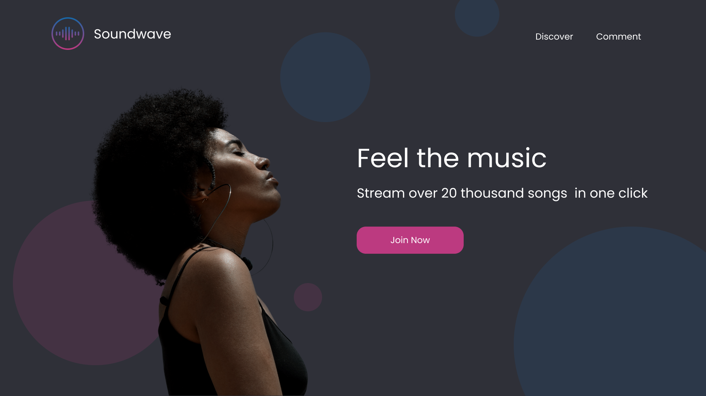
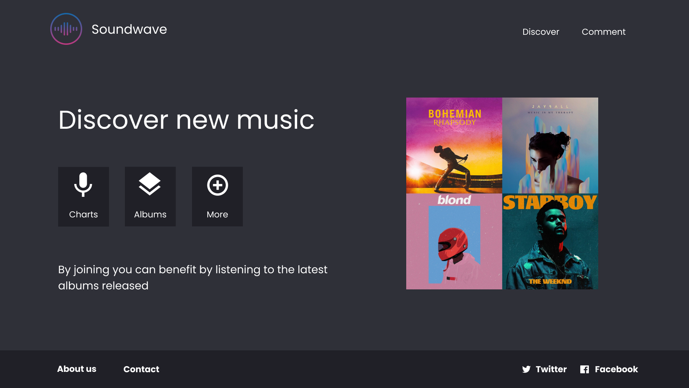
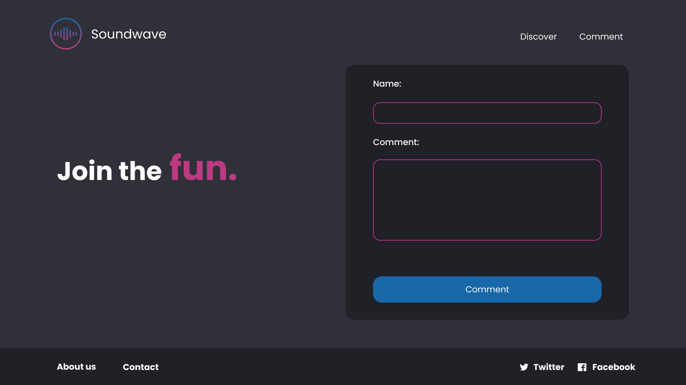

# Landing Page - Feel the Music

Voici votre nouveau projet. Vous avez été engagez pour reproduire le layout Figma d'un site concurrent de Spotify.

Votre designer vous à envoyé le design en screenshot. A vous de le reproduire en HTML.

## Consignes

* Soyez le plus fidèle possible au modèle
* Chaque page doit contenir le même header et footer. Pour le moment il faudra les réaliser en dur sur chaque page. 
  * **Le header**: doit contenir le logo et le titre à gauche. Le menu est sur la droite.
  * **Le footer**: un menu à gauche vers d'autres pages (href="#") et à droite les liens sociaux.
* Il vous faut 3 pages: 
  * **index.html**: la page d'accueil
    * Il faut le portrait de la femme
    * A sa droite doit se trouver le titre d'accroche, le sous-titre et le bouton pour arriver sur la page "comments.html"
  * **discover.html**: la page qui présente le produit. Cette page est un peu plus libre.
    * Affichez quelques pochettes d'album que vous aimez
    * Placez un texte d'accroche
  * **comments.html**: la page avec les commentaires et la possibilités d'en rajouter.
    * Affichez un formulaire avec 2 champs ("auteur" et "comment")
    * Placez un bouton pour envoyez votre formulaire.
    * Affichez les commentaires récupérés par l'API (voir plus bas) 
* Il vous faut une feuille de style **"style.css"**
* Il vous faut une page **"scripts.js"**
  * Il vous faut réaliser un système de commentaire léger. 
  * Suivez les consignes des exercices Javascript de cette semaine pour y arriver.
  * Utilisez l'API suivante: `https://quotes-light-api.herokuapp.com/api/comments/`

## Screenshot

### index.html

### discover.html

### comments.html

